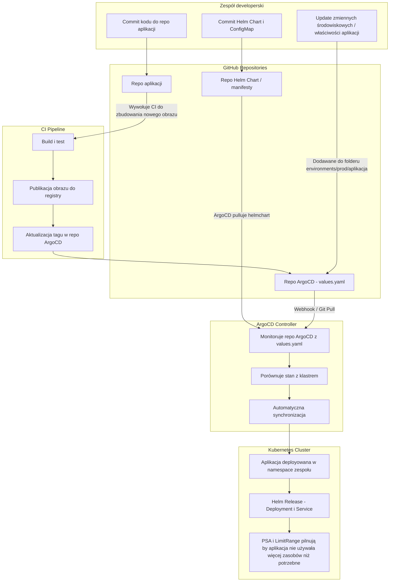

# Propozycja potoku CD dla klastra produkcyjnego kubernetes

Moja propozycja rozwiązania CD dla środowiska produkcyjnego będzie składało się z kilku większych kroków.

## 1. Konfiguracja zasobów wymuszająca spełnianie pewnych wymagań
Na ten krok składają się następujące działania:


### Skonfigurowanie Pod Security Admission Controller
Jest to wbudowany kontroler (od wersji v1.25) wymuszający polityki bezpieczeństwa na poziomie poda,
tzn zezwala na ograniczenie stosowania złych praktyk takich jak chociażby uruchamianie kontenera jako root
Dla celów klastra produkcyjnego zastosowałbym politykę `Restricted` z trybem `enforce` aby nie zezwolić
na tworzenie podów, które nie spełniają praktyk bezpieczeństwa. Przykładową konfigurację cluster wide zamieszczam poniżej. Aby ją wprowadzić trzeba zedytować następujący plik:

```
/etc/kubernetes/manifests/kube-apiserver.yaml
```
dodając wpis

```yaml
spec:
  containers:
  - command:
    - kube-apiserver
    - --enable-admission-plugins=...,PodSecurity
    - --admission-control-config-file=/etc/kubernetes/podsecurity-admission.yaml
```

```yaml
# Wymaga conajmniej wersji Kubernetesa 1.25
apiVersion: apiserver.config.k8s.io/v1
kind: AdmissionConfiguration
plugins:
- name: PodSecurity
  configuration:
    apiVersion: pod-security.admission.config.k8s.io/v1
    kind: PodSecurityConfiguration
    defaults:
      enforce: "restricted"
      enforce-version: "latest"
      audit: "restricted"
      audit-version: "latest"
      warn: "restricted"
      warn-version: "latest"
    exemptions:
      usernames: []
      runtimeClasses: []
      namespaces: [kube-system]
```

Co jest tu najważniejsze
-  wymuszam politykę `restricted` dla wszystkich podów (nie mogą być chociażby uruchomione jako root i inne [ustawienia](https://kubernetes.io/docs/concepts/security/pod-security-standards/#restricted) )
- `exemptions`, jest to pole na wyjątki które nie podlegają konfiguracji polityk bezpieczeństwa, w tym przypadku jedynie będą do tej grupy należeć pody z namespace'a `kube-system`


Więcej o tym wraz z przykładami [tutaj](https://kubernetes.io/docs/tutorials/security/cluster-level-pss/)


### Zarządzanie używanymi zasobami przez każdą aplikację

W tym przypadku stworzyłbym helm charta dla łatwego zarządzania namespace'ami i zasobami każdej aplikacji który zawierałby dwa manifesty `Namespace` i `LimitRange` przyporządkowany do każdego namespace'a. Taka konfiguracja pomogłaby wymóc na każdym kontenerze posiadanie ograniczonych zasobów nawet jeżeli deweloper nie określi zasobów do jakich klaster będzie miał dostęp.

Przykładowy helm chart który mógłby realizować to zadanie zamieściłem [tutaj](./charts/limits/). Generuje on dla każdego namespace'a `LimitRange` określające minimalne, maksymalne wartości zasobów pamięci i CPU jakie może dany pod w namespace'ie posiadać. Definiuje również on wartości domyślne jakie pod będzie przyjmował, jeżeli nie zostaną one zdefiniowane w jego manifeście.


## 2. Konfiguracja repozytoriów

Dla celów automatycznego wdrażania na klaster stworzyłbym dwa repozytoria.
- pierwsze by służyło jako centralne repozytorium dla przechowywania helm chartów wszystkich projektów mikroserwisów aplikacji. Też korzystanie z helmchartów zezwala deweloperom na łatwie ustawianie przykładowo zmiennych środowiskowych w aplikacji, bez koniecznej ingerencji DevOpsa.
- drugie przechowywałoby wszystkie pliki i wartości konfiguracji dla aplikacji ArgoCD służacej do automatycznego wdrażania aplikacji na podstawie zdefiniowanych plików yaml. Do niego też można by było w potokach CD aplikacji wdrożyć możliwość modyfikacji plików w repozytorium (na przykład zmiana wersji obrazu dockerowego na nowy release). Do tego repozytorium dostęp mieliby deweloperzy którzy za pomocą tworzonych pull requestów mogliby dodawać nowe aplikacje czy modyfikować istniejące.


## 3. Konfiguracja ArgoCD

Argo CD pełni w tym rozwiązaniu rolę systemu GitOps, który automatycznie synchronizuje stan klastra Kubernetes z konfiguracją opisaną w repozytoriach Git. Dzięki temu każde wdrożenie jest odtwarzalne, wersjonowane i audytowalne. Na potrzeby proponowałbym taki układ plików w repozytorium:


```
argocd-config-repo/
├── README.md
│
├── projects/
│   ├── default-project.yaml
│   └── production-project.yaml
│
├── applications/
│   ├── app-of-apps.yaml
|   ├── apps/
│   │   ├── app1.yaml
│   │   └── app2.yaml
│   ...
│   └── infrastructure/
│       ├── ingress-nginx.yaml
│       ├── cert-manager.yaml
│       └── monitoring-stack.yaml
│
├── environments/
│   │
|   .....
│   └── prod/
│       ├── app1/
|       |   └──values.yaml
│       └── app2/
|           └──values.yaml
│
└── clusters/
    ├── argo-cluster.yaml
    └── prod-cluster.yaml
```
Krótki opis jakie obiekty Custom Resource Definition (CRD) by się znalazły w którym folderze:
### `projects`
Znalazłaby się tutaj definicja zasobów `AppProjects` w których zdefiniowałbym chociażby:
- uprawnienia i reguły dostepu
- `SyncWindow` dla wyłączenia automatycznej synchronizacji w tzw `buisness hours` czyli, żeby nowa wersja aplikacji nie została wypuszczona w czasie największego ruchu aplikacji.

Przykładowy AppProject z zastosowaniem `syncWindow` w czasie godzin biznesowych (9-17 czasu polskiego) zamieściłem [tutaj](./projects/my-project.yaml)

### `applications`

Znalazłaby się tutaj definicja zasobów `Applications` CRD  wskazująca na repo z helmchartami aplikacji. Każda z tych aplikacji wykorzystywałaby odpowiedny plik `values.yaml` z folderu `environment/prod/<aplikacja>/`. Dla przykładu:

```yaml
apiVersion: argoproj.io/v1alpha1
kind: Application
metadata:
  name: hello-world-prod
  namespace: argocd
spec:
  project: my-project
  sources:
    - repoURL: https://github.com/DocentSzachista/argo-cd-playground
      targetRevision: master
      ref: values
    - chart: hello-world
      repoURL: https://helm.github.io/examples
      targetRevision: 0.1.0
      helm:
        valueFiles:
        - $values/environment/prod/hello-world/values.yaml
  destination:
    server: https://kubernetes.default.svc
    namespace: myapp
  syncPolicy:
    automated:
      selfHeal: true
      prune: true
```
Application hello-world-prod tworzy aplikacje z helm charta na namespace myapp. Wykorzystuje dwa źródła, jedno jest repozytorium, które przetrzymuje helm chart aplikacji a drugie jest repozytorium od argocd które przekazuje ścieżkę do pliku values za pośrednictwem `ref: values`.
Ten plik został równiez zamieszczony [tutaj](./applications/apps/hello-world.yaml)


Dla automatycznego wdrażania nowo dodanych obiektów `Applications` stworzyłbym plik `app-of-apps.yaml` który zawierałby obiekt `applications` który wskazywałby na folder `apps` w repozytorium. Dzięki temu możliwe by było dodawanie z automatu nowych aplikacji bez konieczności wywoływania komend `kubectl` czy `argocd`. Przykładowy manifest stworzyłem [tutaj](./applications/app-of-apps.yaml).
Ważną rolę w tym manifeście którą opisałem wyżej odpowiada następujący fragment:
```yaml
source:
  repoURL: 'https://github.com/DocentSzachista/argo-cd-playground'
  targetRevision: main
  path: applications/apps
```

#### `infrastructure`
- W klastrach kubernetes zarządzanych przez chmurę takich jak AKS/GKE chociażby ingress controller jest tworzony automatycznie i cała obsługa ruchu sieciowego jest obsłuchiwana przez dostawcę. W przypadku selfhosted kubernetes musimy skonfigurować własny `ingress controller` dla rozpatrywania obiektów ingress utworzonych przez helm charty deweloperów.
- Dla uzyskania certyfikatów SSL/TLS z lets encrypt skonfigurowałbym `cert-manager'a` tak aby móc obsługiwać ruch przez protokół `https`
- Aby móc przetrzymywać na repozytorium dane wrażliwe wykorzystałbym kontroller ["Sealed-Secrets"](https://github.com/bitnami-labs/sealed-secrets?tab=readme-ov-file#public-key--certificate) od bitnami
<!-- TODO: dodać sekcję o external secrets itd -->
<!--  - Oprócz rozwiązań sieciowych bym w tym miejscu trzymał konfigurację aplikacji z -->

### `environments`
jest to ścieżka gdzie przechowywałbym konfiguracje plików values.yaml dla każdej z aplikacji. Jeżeli by zaszło zapotrzebowanie na stworzenie procesu CD dla innych środowisk niż produkcyjnie to wystarczyłoby jedynie stworzyć folder z nazwą odpowiedniego środowiska

### `clusters`
Przechowuje pliki definujące połączenie z klastrem kubernetes w postaci sekretów kubernetesowych. Aby przechowywanie ich było bezpieczne (żeby nie wyciekły dane autoryzujące) będą zakodowane w postaci `SealedSecrets` z wykorzystaniem kontrolera `Sealed-Secrets`.


## 4. Potok CD w repozytorium

Dla pełnej automatyzacji procesu jak już aplikacja byłaby wdrożona do ArgoCD, to dodałbym możliwość po zrobieniu przez CI release'a nowego obrazu dockerowego trigger / skrypt, który wpierw przeskanuje obraz dockerowy pod kątem **podatności bezpieczeństwa**, a następnie, jeżeli nie wykryje żadnych krytycznych podatności, to  zmodyfikuje tag obrazu w pliku `values.yaml` na repozytorium ArgoCD (przykładowo modyfikowanie wartości `.Values.image.tag` w [`environment/production/app1/values.yaml`](./environment/prod/hello-world/values.yaml)).


### Github akcja do wykonania zadania

Każde repo aplikacji zawierałoby workflow zawierający taki zbiór akcji:

```yaml
on:
  release:

jobs:
  trivy_scan:
    runs-on: ubuntu-latest
    steps:
      - name: Checkout repository
        uses: actions/checkout@v4
      - name: Login to Docker registry
        uses: docker/login-action@v3
        with:
          registry: ghcr.io # Tutaj rejestr dockerowy organizacji
          username: ${{ secrets.DOCKER_USERNAME }}
          password: ${{ secrets.DOCKER_PASSWORD }}
      - name: Pull Docker image
        run: docker pull ghcr.io/${{github.repository}}:${{ github.event.release.tag_name}}

      - name: Run Trivy scan
        uses: aquasecurity/trivy-action@master
        with:
          image-ref: "ghcr.io/${{github.repository}}:${{github.event.release.tag_name}}"
          format: "table"
          exit-code: 1
          ignore-unfixed: true
          severity: "CRITICAL,HIGH"

  deploy_to_production:
    needs: trivy_scan
    runs-on: ubuntu-latest
    steps:
      - name: Checkout argoCD repository
        uses: actions/checkout@v4
        repository: "<argocd-repo>"
        token: ${{ secrets.GITHUB_AUTH_TOKEN }}
        path: 'argocd'
      - name: Change image tag in argo repository
        run: |
          FILE="argocd/environment/<app>/values.yaml"
          NEW_TAG='${{github.event.release.tag_name}}'
          yq eval ".images.tag = \"${NEW_TAG}\"" -i "$FILE")
      - name: Commit changes to github repo
        env:
          CI_COMMIT_MESSAGE: "Update image tag for <app> on prod environment"
          CI_COMMIT_AUTHOR: github-actions[bot]
          CI_COMMIT_EMAIL: username@users.noreply.github.com
        run: |
          cd argocd
          git config --global user.name "${{ env.CI_COMMIT_AUTHOR }}"
          git config --global user.email "${{ env.CI_COMMIT_EMAIL }}"
            # Changes
          git checkout -b bot/update-<app>-tag
          git add ./environment/<app>/values.yaml
          git commit -m "${{ env.CI_COMMIT_MESSAGE }}"
          git push --set-upstream origin bot/update-<app>-tag
```

Powyższy workflow wykonywałby się tylko w przypadku tworzenia release'u Zawiera w sobie dwa joby:

- `trivy scan`.
- `deploy-to-production`

#### `Trivy-scan`
Dla uzyskania dostępu do rejestru dockerowego skonfigurowałbym dane do logowania i zapisał je w sekretach Github actions dla bezpiecznego do nich dostępu przez workflow.

Dzięki temu mogę pobrać już zbudowany obraz przez inną akcję i przeprowadzić jej skan za pomocą trivy

Skan jest przeprowadzany w poszukiwaniu podatności `CRITICAL` i `HIGH`. Jeżeli zostaną takie znalezione akcja zakończy się niepowodzeniem i nie przejdzie do kolejnego joba
#### `deploy-to-production`
Job ten wykonuje następujące rzeczy:
- pulluje repozytorium githubowe ArgoCD
- zmienia tag obrazu aplikacji na nowy release
- Tworzy nowy branch, dodaje do niego commita i wypycha go do repozytorium na Githubie

Aby się to zadanie powiodło należy skonfigurować [`Github App`](https://docs.github.com/en/apps/creating-github-apps/about-creating-github-apps/about-creating-github-apps) i wygenerowany token zapisać jako secret w repozytorium.


## Jak wyglądałby flow CD z punktu widzenia developera:





## Proponowane technologie
- `Git / Github` dla przechowywania kodu źródłowego helm chartów jak i manifestów YAML ArgoCD
- `ArgoCD` dla automatycznego stawiania i synchronizacji aplikacji zgodnie z zawartością repozytorium
- `Helmcharty` dla tworzenia łatwo edytowalnych manifestów kubernetesowych aplikacji mikroserwisowych
- `Github Actions` do przeprowadzania zmiany wersji obrazów w repozytorium z argoCD
- `Trivy` jako narzędzie do skanowania podatności obrazów używanych w kontenerach przed update'em obrazu w repozytorium.
- `Sealed-secrets` jako narzędzie do zabezpieczenia haseł bądź innych danych wrażliwych
- `cert-manager` i `nginx-controller` do konfiguracji ruchu sieciowego aplikacji na zewnątrz klastra